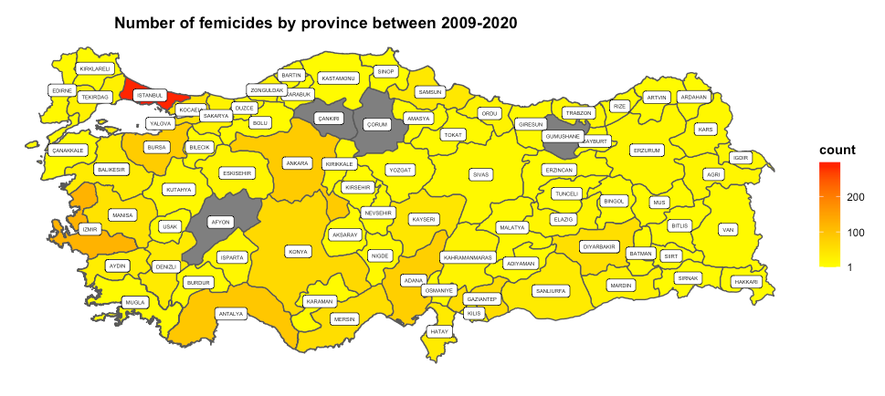
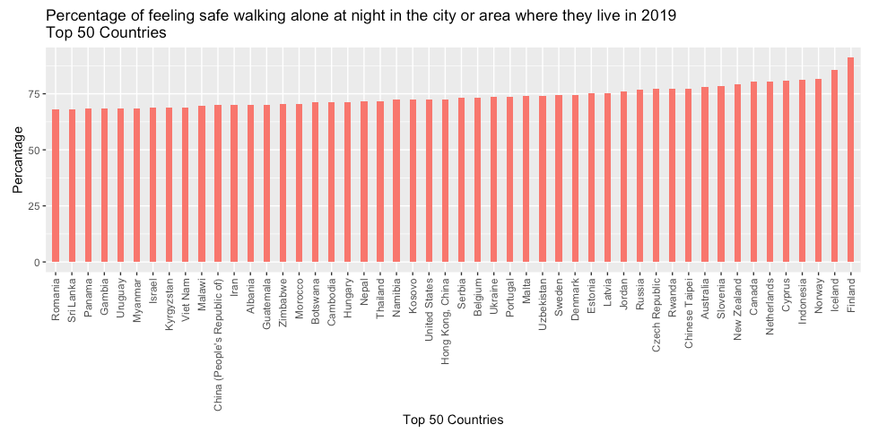

## Introduction

We conducted research on violence against women and femicide, which we carried out together for a period, about the situation of our country and the world. 


We will explain 

•	The starting point of our work,

•	Our aim 

•	The stages of our project 

•	What results we have achieved.

•	Conclusion


---
## The Goal of the Project

The primary objective of the project is to raise awareness in society on femicide and violence against women. We will present incidents that resulted in women femicide, the type of violence against women and the various factors affecting violence against women and women femicide Furthermore, in the light of this informations,starting from the starting points of women femicides and violence against women, to reveal what measures can be taken to prevent them and what can be done to raise awareness of the society. 
Since the primary purpose of the project is to raise awareness in our country, the results and facts will be understandable from all segments of the society.

In order to provide this awareness in our country:

•	We have compared our country with other countries.

•	Detailed examination of the situation of femicides and violence against women in our country.

We wanted to ensure that the visualizations of the data we obtained are understood by all segments of the society and that our country is conscious of this issue.

---
## Why we chose this topic ?

To tell the reasons why we chose this subject, first of all, we witness the news of death or violence of other women, young or old, every day in our country. 

These reports show that women can be exposed to violence, sometimes while returning from work, sometimes while at home. Now, in our country, a woman has become afraid to go out alone after a certain time.

In order to understand the seriousness of this situation, our aim was to reveal it in detail and to raise awareness of our society.

---
## Datasets

1. **[World Health Organization](https://apps.who.int/gho/data/view.main.IPVv?lang=en)**
  - Prevalence of violence against women by countries and regions
2. **[OECD (Organization for Economic Co-operation and Development)](https://stats.oecd.org/Index.aspx?DataSetCode=GIDDB2019)**
  - A Statistics of different metrics for all countries
    - Percantage of feeling safe walking alone
    - Percentage of suffering intimate partner physical
    - Statistics about law in violance
3. **[The Monumental Counter](http://anitsayac.com/)**
  - A Femicides statistics in Turkey
4. **[Turkish Statistical Institute](https://tuikweb.tuik.gov.tr/MicroVeri/KYAS_2014/ozet-tablolar/index.html)**
  - Rate  of violence against women by education and living areas in Turkey
5. **[IMF Datasets avaible in Wikipedia](https://en.wikipedia.org/wiki/Developed_country#cite_note-qq-13)**
  - The level of economic development of countries
---
## Actions Taken

If we briefly list the processes of our project:

1. As we progressed step by step in this project, we mainly tried to obtain reliable data.

2. We both scraped and dowloaded one of the datasets that we used in our study.

3. Transfered these data we obtained to R with various formats such as excel and csv format.

4. Made some preprocessing to obtain figures in the format we want.

5. Made our data understandable and applicable.

According to the content of our data that we generated, it was visualized in different ways with R visualization methods. These figures are sometimes in the form of bar charts, sometimes in the form of pie charts or maps.

---
.pull-left[
The regions divided according to their income and location, it is possible to say that the income of the country is also a factor that affects the prevalence of violence against women since it is based on the Global Burden of Disease (GBD) regional classification system. we can see that the regions with the highest prevalence of violence against women are in Africa
]

.pull-right[
```{r echo=FALSE, out.width='100%', fig.cap=''}
  
```

```{r echo=FALSE, out.width='100%', fig.cap=''}
  
```
]

---
First of all, it is a map showing the economic development of the countries in the world to IMF data in order to compare our country with other countries.

.center[
```{r echo=FALSE, out.width='100%', fig.cap=''}
  
```
]

---
.pull-left[
Bar graph shows the situation of our country with other countries in terms of violence against women between the ages of 15-49. This is clearly seen on the world map.

As we can see WHO data on the world map, countries where the prevalence of violence in the 15-49 age group is high in the world are in the African continent. Although Turkey is better off compared to these countries, it is in the middle in terms of prevalence of violence against women, but most of these countries are not developed countries.
]

.pull-right[
```{r echo=FALSE, out.width='70%', fig.cap=''}
  
```

```{r echo=FALSE, out.width='70%', fig.cap=''}
  
```
]

---
.center[
```{r echo=FALSE, out.width='40%', fig.cap=''}

```
]

Again, when we compare the WHO data without age restrictions on the world map and the prevalence of violence against women, we see that the developed countries have similar values to each other. Turkey has a higher rate than these countries.
It can be deduced that Turkey is not at a good enough level in terms of violence against women, and the prevalence of violence should fall below a certain level and should be at the level of developed countries.
---
.center[
```{r echo=FALSE, out.width='50%', fig.cap=''}
  
```

```{r echo=FALSE, out.width='40%', fig.cap=''}
  
```
]

Even though Turkey is in a good condition compared to these African or some Asian countries, it is the third country with the highest prevalence of violence against women compared to its neighboring countries, namely Europe and Asia.
---
```{r echo=FALSE, out.width='60%', fig.cap=''}
  
```


According to the Monument Counter data, the number of murders of women in Turkey has increased over the years, according to reports published on social media or in news newspapers. We observed an increasing trend between 2011-2020.

---
.pull-left[
Based on TUIK data, the importance of education comes to the fore as a factor affecting violence against women in Turkey. As the education level increases, the prevalence of violence decreases. Again, if we examine these data in terms of living places and regions, as the living standards increase, the rate of women being subjected to violence decreases.
]

.pull-right[
```{r echo=FALSE, out.width='110%', fig.cap=''}
  
```
]

---
.pull-left[
Between 2008-2020, we see that most of their killers were committed by their husbands. Unfortunately, domestic violence and homicides account for a large proportion of femicides in our country.

About half of the murder tools are firearms, while 3 out of 4 murders are committed with knives and guns. The widespread use of unlicensed weapons leads to an increase in these murders.

]
.pull-right[
```{r echo=FALSE, out.width='90%', fig.cap=''}
  
```

```{r echo=FALSE, out.width='90%', fig.cap=''}
  
```
]

---
When we look at the distribution of cities where the murder was committed, the most murders are committed in 3 major cities. When we looked at the population, this was the excepted result.


.center[
```{r echo=FALSE, out.width='50%', fig.cap=''}
knitr::include_graphics('figures/city_piechart.png')  
```
]

---
.pull-left[
Looking at the distribution of murders by age status, the most important thing is that in recent years, the murder of women aged 18 and under has increased. As the number of murders has increased over the years, the increase in adult murders was the result we expected.
]

.pull-right[
```{r echo=FALSE, out.height='90%', out.width='90%', fig.cap=''}
 
```

```{r echo=FALSE, out.height='70%', out.width='70%',  fig.cap=''}

```
]

---
May and September are the months which most murders are committed when we look at the murders committed by all the years. We also found that this result was consistent with a study conducted by the General Directorate of Security.


.center[
```{r echo=FALSE, out.width='50%', fig.cap=''}
  
```
]

---

We see the distribution of femicides in Turkey, according to data available at the Monument Counter website. While the highest number of murders are seen in Istanbul, which has the highest human population, metropolitan cities such as Izmir and Ankara follow respectively. Unfortunately, Diyarbakir has a serious number of femicides in the eastern region.


.center[
```{r echo=FALSE, out.width='80%', fig.cap=''}
  
```
]

---
We plotted the 50 highest and 50 lowest countries using the ratio of ever-partnered women who ever suffered intimate partner physical and/or sexual violence in 2019. The place of Turkey was highlighted with red and placed 28th among the top 50 countries.


.center[
```{r echo=FALSE, out.width='50%', fig.cap=''}
  
```

```{r echo=FALSE, out.width='50%', fig.cap=''}
  
```
]

---
We also plotted the 50 highest and 50 lowest countries using the index of feeling safe walking alone at night in 2019. The place of Turkey     again was highlighted with red and placed 24th country from the end.

.center[
```{r echo=FALSE, out.width='50%', fig.cap=''}
  
```

```{r echo=FALSE, out.width='50%', fig.cap=''}
  
```
]

---
This world map takes values between 0-1 divided by 5. As the value goes from 0 to 1, the color on countries turns dark red. 0 means that the legal framework protects women from violence including intimate partner violence, rape and sexual harassment, without any legal exceptions and in a comprehensive approach while 1 means that the legal framework does not protect women from violence nor intimate partner violence nor rape and sexual harassment.

Turkey's get value as 0.5 means the legal framework protects women from violence including intimate partner violence, rape, and sexual harassment. However, some legal exceptions occur.

```{r echo=FALSE, out.width='80%', fig.cap=''}
  
```

---
## Challenges

To list the problems we encountered during our project:
 
1. To find reliable and up-to-date data, when comparing countries, the study in each country is not done in the same years

2. Some data is not available in English

3. Too much preprocessing required to visualize some datasets

4. While scraping monument counter dataset, we had a hard time getting it in the right format because of the complexity of the site's source code.
---
## Results and Discussion

We can say that our country is not in a good situation compared to other countries, in the light of the data we have obtained for awareness on violence against women and femicide, which is our goal.
 
As various factors affecting the emergence of this situation:

•	Education level, 

•	Income level, 

•	Place of residence,

•	Laws.

can be given.

In order to become better and raise awareness in our country and the world , it is necessary to raise awareness of our society, to improve our education level and to take steps in this regard.

---
## Conclusion
Our aim in doing this study is to explain with data that the number of femicide in the last 10 years is a serious issue that cannot be ignored both in Turkey and in the world. 

Finally, it has been understood that the world and our country are not in a very good situation in terms of violence against women today.This is a hopeless result because it is understood from the frequency of violence against women and femicide that the studies are still insufficient. We hope that in the coming years, a definitive solution will be brought to this issue and more serious laws and penalties will be enacted on femicide.


